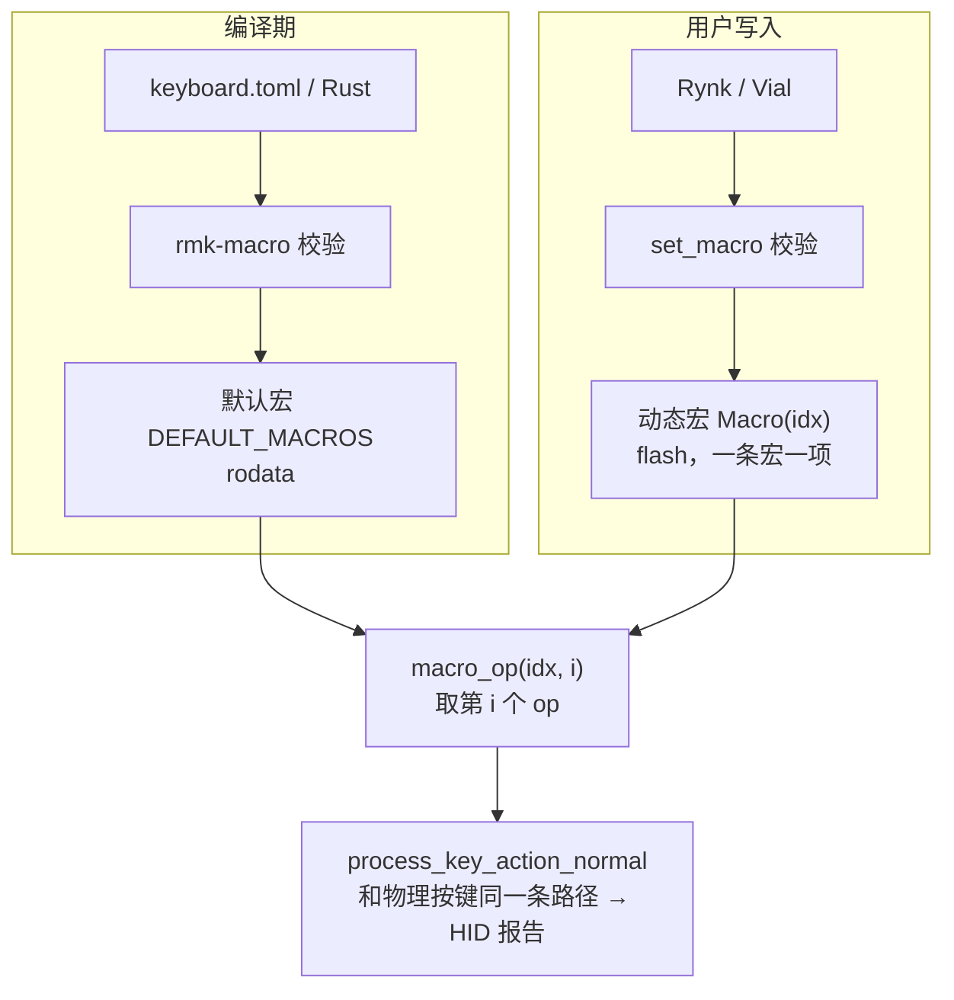
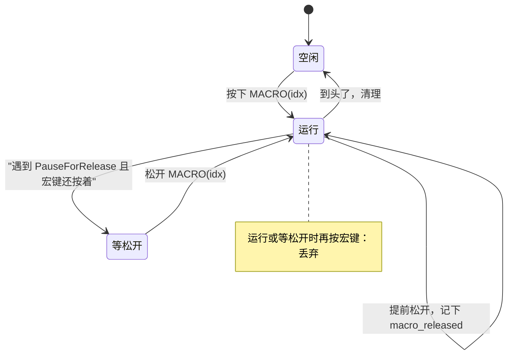

# Macro 子系统重构

## 0. 一句话

宏是一串带 `Action` 的步骤。编译期定义的宏放在 rodata，用户改过的宏一条一个存储项放在 flash，值就是步骤数组。执行时键盘按序号取步骤，用现有的 deadline 机制推进，步骤和物理按键走同一条分发路径。Vial 只是一个有损的兼容视图。

名词约定：

- **op**：宏的一个步骤，类型是 `MacroOp`。
- **idx**：宏的编号，也是键位上 `MACRO(idx)` 里的数字。
- **默认宏**：`keyboard.toml` 或 Rust 里定义的宏，编译进 rodata。
- **动态宏**：通过 Rynk 或 Vial 写进 flash 的宏。同一个 idx 有动态宏就用动态宏，没有就用默认宏。

## 1. 目标

| 目标 | 怎么验收 |
|---|---|
| 宏运行时键盘照常工作 | 宏等待 5 秒期间，按键、tap-hold、combo、鼠标重复都正常 |
| 宏的输出和物理按键互不干扰 | 宏能同时按住 A 和 B；宏松开 Ctrl 不影响手按着的 Ctrl；宏结束后没有残留的按键 |
| 每个步骤和物理按键的行为一样 | 同一个动作，来自 TOML、Rust、Vial、Rynk 的效果相同 |
| 宏的表示和 Vial 无关，写入前就校验 | 不开 `vial` feature 也能用所有功能；坏数据在写入或编译时报错，不会变成乱键或 panic |
| 一次运行只用一个版本，写入要么成功要么失败 | 一条宏是一个存储项，整项替换；断电后只会看到旧版本或新版本 |

## 2. 总览



## 3. 数据模型

定义在 `rmk-types`，postcard 派生序列化。

```rust
pub enum MacroOp {
    Tap(Action),         // 按一下
    Press(Action),       // 按下不放
    Release(Action),     // 松开
    Delay(u16),          // 等待，毫秒
    Char(u8),            // 输入一个 ASCII 字符
    PauseForRelease,     // 分界线：前面的在按下宏键时执行，后面的在松开宏键时执行
}
pub type Macro = heapless::Vec<MacroOp, MACRO_MAX_OPS>;
```

- `MacroOp` 在 RAM 里 4 字节。`Char` 用 `u8` 就是为了这个；以后支持 unicode 换成 `char`，ASCII 的 postcard 编码不变。
- 一条宏在线上、flash、rodata 三处都是 op 数组，长度就是数组长度。
- TOML 里的 `text = "abc"` 和 Rust 里的字符串会展开成一串 `Char`。
- 一条宏最多一个 `PauseForRelease`。

一个共用函数：

```rust
pub fn validate_macro(ops: &[MacroOp]) -> Result<(), MacroError>;   // 编译期和写入时都用它
```

拒绝三种内容：宏里出现 `MACRO(n)`、第二个 `PauseForRelease`、非 ASCII 的 `Char`。错误类型 `MacroError { Invalid, StorageFault }`。没有 `storage` feature 时写入返回 `Unsupported`。

配置项：

| 常量 | 默认 | 含义 |
|---|---|---|
| `MACRO_MAX_NUM`，来自 `[rmk].macro_max_num` | 32 | 最多几条宏，上限 255。新增 |
| `MACRO_MAX_OPS`，来自 `[rmk].macro_max_ops` | 32 | 一条宏最多几个 op，上限 255。新增 |
| `MACRO_SPACE_SIZE`，来自 `[rmk].macro_space_size` | 256 | 只给 Vial 视图缓冲用，仅 `vial` 构建分配。保留 |

删除 `protocol_macro_chunk_size`。`MACRO_MAX_OPS` 是唯一影响 RAM 的旋钮：见第 4 节。

怎么定义宏：

- `rmk-macro` 在编译期生成 `static DEFAULT_MACROS: &[&[MacroOp]]`。用 `validate_macro` 检查内容，用两个常量检查条数和每条长度。不合法就编译报错。`rmk-config` 里原来按字节估算的检查删掉。
- `keyboard.toml`：现有的 `tap`、`down`、`up`、`delay`、`text` 五种写法不变；`keycode` 可以写任意动作，比如 `WM(A, LCtrl)`，不再需要 `vial` feature；新增 `{ operation = "pause_for_release" }`。
- Rust：`BehaviorConfig.keyboard_macros: &'static [&'static [MacroOp]]`，直接写字面量。`macros![]` 只是把字符串变成 `Char` 的语法糖。这是破坏性变更。
- 删除 `keyboard_macros.rs` 里的全部旧代码。

## 4. 存储

一条宏一个存储项，值就是 op 数组，走现有的 `store` 和 `read`。

```rust
StorageKey::Macro(u8)  →  StorageValue::Macro(Macro)
```

- 宏的长度就是数组长度。改短一条宏就是写一个更短的数组，旧版本由 GC 回收。
- 默认宏永远不写进 flash。清空一条宏 = 写空数组。恢复默认 = 把默认宏写进 flash。都不需要删除操作。
- 键盘 RAM 里只有一个位图 `macro_in_flash: [bool; MACRO_MAX_NUM]`，记哪些 idx 在 flash 里有动态宏。开机遍历存储项时置位。
- RAM 账：`Vec<MacroOp, 32>` 是 136 字节。BLE 构建的 `StorageValue` 本来就被 `ProfileInfo` 撑到 148，塞得下，零成本；非 BLE 构建从 68 涨到 140，乘 4 个 channel 槽加回复槽加存储任务栈，约 430 字节。和现在的 272 乘 6 比都是净减。`MACRO_MAX_OPS` 每加 1，非 BLE 约多 24 字节，BLE 到 34 之前免费。
- flash 上限静态可算：`MACRO_MAX_NUM × MACRO_MAX_OPS` 个 op，每个约 4 字节。
- `SCHEMA_HASH` 用 `MACRO_MAX_OPS` 替换 `MACRO_SPACE_SIZE`。固件升级会清空存储，不做旧数据迁移。
- 删除 `StorageItem::MacroData`、`host/storage.rs::macro_bytes_serde`、`KeyboardMacrosConfig`。
- 没有 `storage` feature：宏只读，只有默认宏；写入返回 `Unsupported`，`DeviceCapabilities.macros_writable = false`。

`KeyMap` 上两个函数：

```rust
async fn set_macro(&self, idx: u8, ops: &[MacroOp]) -> Result<(), MacroError>;
async fn macro_op(&self, idx: u8, i: u8) -> Option<MacroOp>;   // 第 i 个 op；None 表示到头了
```

`set_macro`：`validate_macro`，idx 或长度超范围返回 `Invalid`；这条宏正在运行就先结束它（方案 B 不需要）；`store(Macro(idx, ops))` 等回复，失败返回 `StorageFault`；成功后置位 `macro_in_flash[idx]`。

`macro_op`：`macro_in_flash[idx]` 为假就返回 `DEFAULT_MACROS[idx][i]`，否则 `read(Macro(idx))` 拿回数组取第 i 个。

恢复默认 = `set_macro(idx, DEFAULT_MACROS[idx])`。清空 = `set_macro(idx, &[])`。

## 5. 执行

执行器接进键盘现有的 `next_deadline` / `fire_expired`。宏的下一步时间和 tap-hold、one-shot、鼠标重复的 deadline 一起取最小值。`held_buffer` 不动。

读 op 有两种做法。先实现 A，再实现 B，在同一块板上比较 `.bss` 和 `.data`，留下 RAM 更小的，或者差距不大时更简单的那个。触发、推进、清理和 `Char` 的规则两者相同。

### 5.1 方案 A：每一步读一次

```rust
// Keyboard
macro_next: Option<(u8, u8, Instant)>,   // (idx, 下一个 op 的序号, 什么时候执行)；None = 没有宏在跑；Instant::MAX = 等松开
macro_released: bool,                    // 宏键已经松开
macro_modifiers: ModifierCombination,    // 宏按住的修饰键
```

每步调 `macro_op(idx, i)`。默认宏直接取数组，动态宏是一次存储往返。键盘里不保存宏。改写正在运行的宏要先结束它。

### 5.2 方案 B：触发时读一次

```rust
// Keyboard
macro_buf: Macro,                        // 正在跑的宏的副本，136 字节
macro_next: Option<(u8, Instant)>,       // (下一个 op 的序号, 什么时候执行)
macro_released: bool,
macro_modifiers: ModifierCombination,
```

触发时把整条宏拷进 `macro_buf`，之后每步 `macro_buf[i]`，运行期间不碰存储。因为是副本，改写宏不需要先结束它。

### 5.3 触发和推进

- 按下 `MACRO(idx)`：已经有宏在跑就丢弃并 warn（宏不并发）；否则从第 0 个 op 开始，时间设为现在，`macro_released = false`。
- 松开 `MACRO(idx)`：如果正在跑的就是这条，`macro_released = true`；如果它正在等松开，前进一个 op，时间设为现在。松开事件经过 keymap 解析还是 `MACRO(idx)`，不需要记住宏键的位置。
- 时间到了就执行一个 op。执行的方法是 `process_key_action_normal(action, KeyboardEvent { pos: Macro(idx), pressed })`，下面简写为"按下"和"松开"。

| op | 做什么 | 之后 |
|---|---|---|
| `Tap(a)` | 按下 a，松开 a | 下一个 op，马上 |
| `Press(a)` | 按下 a | 下一个 op，马上 |
| `Release(a)` | 松开 a | 下一个 op，马上 |
| `Char(c)` | 见 5.5 | 下一个 op，马上 |
| `Delay(ms)` | 发一帧当前真实修饰键的报告 | 下一个 op，ms 毫秒后 |
| `PauseForRelease` | 发一帧当前真实修饰键的报告 | 已松开：下一个 op，马上。未松开：停在这里等 |
| 到头了 | 清理，见 5.4 | 空闲 |

"马上"是把时间设为现在。键盘任务会先处理排队的按键事件再执行到期的 op，所以按键和宏是交错的。例子：宏 `tap A, delay 10ms, tap B` 跑到一半按了 W，主机收到的顺序是 `[A] [ ] [W] [ ] [B] [ ]`。

按下和松开是连续两帧报告，中间不等待。



### 5.4 输出归属和清理

宏按下的普通键记在 `registered_keys` 里，位置是 `Macro(idx)`。

- `register_keycode` 对 `Macro` 位置每次都用新槽位，所以宏可以同时按住 A 和 B。
- `unregister_keycode` 按位置加键码匹配，`Macro` 位置的松开不会去动物理按键的槽位。
- 宏按住的修饰键记在 `macro_modifiers`，物理修饰键记在 `held_modifiers`。`resolve_modifiers` 把两者或在一起。

```
held_modifiers（物理）   ─┐
macro_modifiers（宏）    ─┼─▶ resolve_modifiers ─▶ 报告里的修饰键
one-shot / with_modifiers ─┘
```

- 宏到头时：松开所有 `Macro` 位置的键，清空 `macro_modifiers`，发一帧报告。没配对的 `Press` 在这里被松开。想让"按住宏键 = 按住一组键"，用 `PauseForRelease`。
- one-shot、Repeat、Caps Word 对宏的 `Tap` / `Press` 和对物理键一样，不加特殊分支。
- 宏的步骤不进 pubsub，不进 `held_buffer`，所以 combo、fork、tap-hold 看不到它们。
- 清理只管普通键和修饰键。层切换、鼠标、Consumer 这类动作要在宏里自己配对。

### 5.5 `Char`

一个 `Char` 就是两帧报告，报告里的修饰键固定为这个字符自己需要的 shift，和当时按着的任何修饰键无关。

```rust
MacroOp::Char(c) => {
    let (key, shift) = from_ascii(c);
    let modifiers = ModifierCombination::new().with_left_shift(shift);
    self.register_keycode(key, KeyboardEvent { pos: Macro(idx), pressed: true });
    self.send_keyboard_report(modifiers).await;
    self.unregister_keycode(key, KeyboardEvent { pos: Macro(idx), pressed: false });
    self.send_keyboard_report(modifiers).await;
}
```

- `build_keyboard_report` 改成接收修饰键参数。`send_keyboard_report_with_resolved_modifiers` 先算 `resolve_modifiers` 再调它，现有 28 处调用不用改。
- 删除 `macro_texting`、`macro_caps` 和 `resolve_modifiers` 里的文本分支。真实修饰键由下一帧自然恢复：下一个按键的报告、物理按键的报告、`Delay`、`PauseForRelease`、结束时发的那一帧都带真实修饰键。
- 效果：`text "AbCd"` 发出 `[LShift,A] [LShift] [B] [] [LShift,C] [LShift] [D] []`。手按着 Ctrl 时 `text "a"` 发出 `[A] []`，之后的一帧恢复 Ctrl。
- `Char` 不走 `process_action_key`，所以不消耗 one-shot，不参与 Caps Word，不更新 Repeat。

## 6. Rynk

```rust
GetMacro = 0x0201: u8 => Macro;                                  // Vec<MacroOp, MACRO_MAX_OPS>
SetMacro = 0x0202: SetMacroRequest { index: u8, ops: Macro } => ();
```

- 一次读写一整条宏，直接传 op 数组，`MaxSize` 约 160 字节。`SetMacro` 调 `set_macro(index, &ops)`；`GetMacro` 返回 `read` 拿回的数组，默认宏则从 rodata 拷。
- 错误：`Invalid`、`StorageFault`；没有 `storage` 时 `Unsupported`。
- `DeviceCapabilities`：删掉 `macro_space_size`、`macro_chunk_size`；新增 `max_macros: u8`、`macro_max_ops: u8`、`macros_writable: bool`。
- `rmk-config`：删掉 `protocol_macro_chunk_size`、`MAX_MACRO_DATA_SIZE`、`MACRO_DATA_SIZE`。
- 主机库：`read_macro(index) -> Vec<MacroOp>`，`write_macro(index, &[MacroOp])`。TS 类型由 rmk-types 的 tsify 生成。rmk-gui 删掉 `macro-codec.ts`。

## 7. Vial

Vial 只认它自己的字节格式，所以 via 里放一块 `vial_buf: [u8; MACRO_SPACE_SIZE]` 当视图。`GetBufferSize` 返回 `MACRO_SPACE_SIZE`。代码放在 `rmk/src/host/via/macros.rs`，#989 的扩展键码编解码也搬过来。


读（`DynamicKeymapMacroGetBuffer`）：offset 为 0 时把所有宏依次渲染进 `vial_buf`，放不下的截掉；之后按 offset 切片返回。渲染规则：

- `Tap` / `Press` / `Release` 一个普通键 → `01 01/02/03 键码`；能转成 Vial 键码的其它动作 → `01 05/06/07` 加 16 位键码（含零字节转义）。
- `Delay` → `01 04` 加两字节；超过 65024 毫秒拆成多段。`Char` → 这个 ASCII 字节。每条宏结尾 `00`。
- `PauseForRelease` 和转不成 Vial 键码的动作跳过。

写（`DynamicKeymapMacroSetBuffer`）：按 offset 填进 `vial_buf`，填满后整块解析。每遇到一个 `00` 就把前面这段解析成一个 `Macro` 交给 `set_macro`，idx 加一。解析规则和上面相反。解析失败、超过 `MACRO_MAX_OPS`、写入失败：warn 并跳过这一条。Vial 存回的就是它看到的，不和原内容比对。

`MacroGetCount` 返回 `min(MACRO_MAX_NUM, 32)`。`MacroReset` 把每条宏写成空。`to_via_keycode` 对 `MACRO(32)` 及以上返回 0。

## 8. 实施顺序

1. `rmk-types`：`MacroOp`、`Macro`、`validate_macro`、`MacroError`、Rynk 类型、能力字段、常量、golden vectors。
2. 存储和 `KeyMap`：`StorageValue::Macro`、`macro_in_flash`、`set_macro`、`macro_op`、`clear_layout`、`SCHEMA_HASH`；`rmk-macro` 生成 `DEFAULT_MACROS` 和编译期检查；删除旧代码。
3. 执行方案 A：`KeyboardEventPos::Macro(u8)`、三个字段、推进、松开、清理、槽位和修饰键归属、`Char`、`build_keyboard_report` 签名；删除 `execute_macro`、`MACRO_TRIGGER_CHANNEL`、`macro_texting`。
4. Vial。
5. Rynk 固件端、主机库、`rynk-wasm`、rmk-gui。
6. 执行方案 B，和 A 比较 RAM，留一个。
7. 测试和文档。

## 9. 测试

场景测试（`rmk/tests/scenarios/`）：

- 和弦：`down A, down B, up B, up A` → `[A] [A,B] [A] []`。
- 修饰键：手按着 Ctrl 时宏 `down LCtrl, tap A, up LCtrl`，之后 Ctrl 还按着；宏只 `down LCtrl` 不松，结束后 Ctrl 被松开。
- 交错：宏 `Delay` 期间按键，报告出现在宏的两段之间；宏期间按下的 tap-hold 按时超时。
- 文本：`text "AbCd"` 的报告序列；手按着 Ctrl 时 `text "a"` 不带 Ctrl，之后的 `tap`、`Delay`、结束各自恢复 Ctrl；one-shot 不被 `Char` 消耗。
- 松开阶段：按住宏键出前半段，松开出后半段；前半段没跑完就松开，跑完后直接接后半段；没有 `PauseForRelease` 的宏松开没影响。
- 不并发：运行中再触发被丢弃。运行中改写同一条宏：方案 A 当前宏立即结束并清理，方案 B 跑完旧副本；下次触发用新内容。
- 改写：改短、清空、恢复默认后执行正确；重启后 `macro_in_flash` 和 flash 一致。
- 不开 `vial`：`Tap(WM(A, LCtrl))`、`Tap(LayerOn(1))` 能用。
- Rynk：读、写、`Invalid`、没有 `storage` 时 `Unsupported`；用 flash 模拟器那一行 feature 跑。Vial 整块写入后执行。

单元测试：postcard 往返和 golden vectors；`validate_macro` 每条规则；Vial 渲染和解析往返、不可渲染的 op 被跳过、超长截断；`rmk-macro` 的编译错误用例（非 ASCII、两个 `PauseForRelease`、宏里套宏、超过 `MACRO_MAX_OPS`、超过 `MACRO_MAX_NUM`）。

## 10. 已知代价

- 宏不并发：运行中或等松开时再按宏键，被丢弃。
- 没有 `storage` 时宏只读。
- Vial 是有损的：`PauseForRelease` 和转不成 Vial 键码的动作在 Vial 保存后丢失，没改过的宏也一样。Vial 按字节数认为放得下的内容，固件可能因为超过 `MACRO_MAX_OPS` 而丢弃这条宏。
- 一条宏最多 `MACRO_MAX_OPS` 个 op，文本一个字符一个 op。要更长就调大，非 BLE 构建每个 op 约 24 字节 RAM。
- 方案 A 每步一次存储往返：存储 key cache 未命中或正在 GC 时，等的是整个键盘任务。
- 按下松开之间没有间隔：`Tap` 和 `Char` 连发两帧，报告通道满了键盘任务会等。
- 行为变化：宏和按键交错；没配对的 `Press` 在宏结束时自动松开；`Tap` 没有保持时间；`Char` 不消耗 one-shot。要写进文档。
